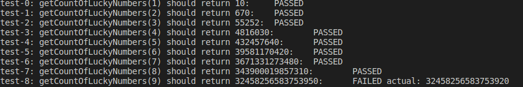

[< А.Пономаренко. Домашние задания к курсам OTUS / Алгоритмы и структуры данных-2022-10 ](../README.md) / Домашнее задание 2. Счастливые билеты.

# Домашнее задание 2. Счастливые билеты.

## Цель:

Решить задачу «Счастливые билеты» и проверить решение по тестам.
Создать систему тестирования на основе файлов.

```
УРОВЕНЬ JUNIOR

6-значный билет считается счастливым,
если сумма 3 первых цифр равна сумме последних 3 цифр.

Посчитать, сколько существует счастливых 6-значных билетов.
Загрузить программу с решением на github или gitlab и выложить ссылку в чат с преподавателем.

Написать в чат с предподавателем ответ и сколько времени ушло на решение задачи и сколько байт набрано.

+1 байт. Решена задача и написан верный ответ.

+1 байт. Проект загружен в репозиторий и ссылка выложена в чат.


УРОВЕНЬ MIDDLE

Скачать и распаковать архив A01_Счастливые_билеты.zip


Прочитать условие задачи \1.Tickets\problem.txt
-----
Счастливые билеты 20

Билет с 2N значным номером считается счастливым,
если сумма N первых цифр равна сумме последних N цифр.
Посчитать, сколько существует счастливых 2N-значных билетов.

Начальные данные: число N от 1 до 10.
Вывод результата: количество 2N-значных счастливых билетов.
-----


Решить задачу в общем случае и протестировать вручную на тестах, которые находятся в архиве.

Загрузить программу с решением на github или gitlab и выложить ссылку в чат с преподавателем.

Написать в чат с предподавателем скриншот одного из тестов.
Написать, сколько времени ушло на решение задачи и сколько байт набрано.

+1 байт. Верно пройдены тесты 0-4.

+1 байт. Верно пройдены тесты 5-7.

+1 байт. Верно пройдены тесты 8-9.


### УРОВЕНЬ SENIOR

Создать систему тестирования на основе файлов.

Проверить работу программы в автоматическом режиме.

Загрузить программу с решением на github или gitlab, приложить ссылку.

Написать в чат с предподавателем скриншот тестирования.

Написать, сколько времени ушло на решение задачи и сколько байт набрано.

+2 байта. Написана программа для тестирования задачи.

+2 байта. Решённая задача успешно прошла все тесты.

+1 байт. Написано, сколько ушло времени на решение задачи.

```

## Выполнение д/з №2
1. JUNIOR

```
getCountOfLuckyNumbers(3) should return 55252:  PASSED
```

2. MIDDLE 

Подготовлен алгоритм с общим решением задачи.

Исходные тексты доступны по ссылке https://github.com/alexanderpono/ponomarenko-alex-otus/tree/master/algo-2022-10/hw02/src

Основная функция автотестов при помощи файлов - https://github.com/alexanderpono/ponomarenko-alex-otus/blob/master/algo-2022-10/hw02/src/app.ts

Основная функция алгоритма вычисления количества счастливых билетов для чисел длиной 2N - getCountOfLuckyNumbers() в файле https://github.com/alexanderpono/ponomarenko-alex-otus/blob/master/algo-2022-10/hw02/src/lib.ts


Алгоритм успешно проходит тесты 0-7.

Результаты запуска теста 8 расходятся с референсным значением (см. скриншот ниже).


3. SENIOR

Создана оболочка тестирования, которая загружает из тектовых файлов входные и ожидаемые выходные данные, запускает тесты и соравнивает фактический результат с референсным значением.


4. Скриншот запуска программы автотестирования


5. Затраты ны выполнение д/з

На выполнение д/з потрачено 7 часов.

6. Самооценка

JUNIOR

+1 байт. Решена задача и написан верный ответ.

+1 байт. Проект загружен в репозиторий и ссылка выложена в чат.

MIDDLE

+1 байт. Верно пройдены тесты 0-4.

+1 байт. Верно пройдены тесты 5-7.

SENIOR

+2 байта. Написана программа для тестирования задачи.

+1 байт. Написано, сколько ушло времени на решение задачи.

