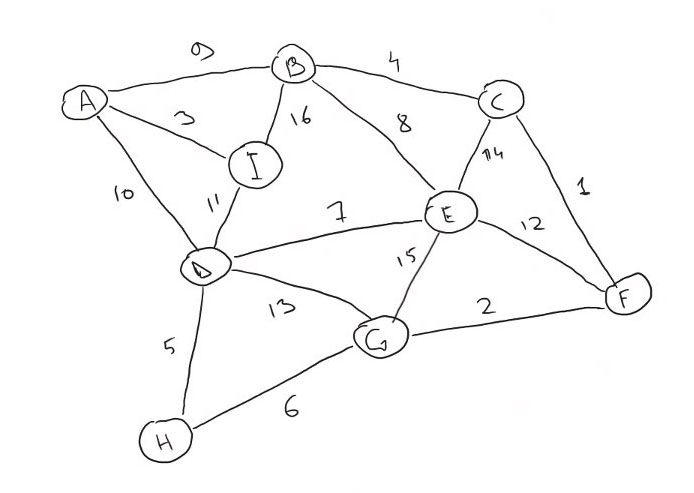
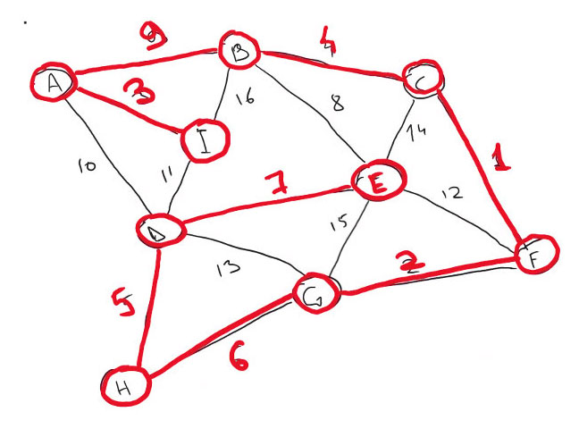

[< А.Пономаренко. Домашние задания к курсам OTUS / Алгоритмы и структуры данных-2022-10 ](../README.md) / Домашнее задание 19. Минимальный скелет

# Домашнее задание 19. Минимальный скелет

Реализовать алгоритм нахождения минимального остовного дерева

## Цель:

В этом домашнем задании вы научитесь реализовывать алгоритм нахождения минимального остовного дерева.

## Описание/Пошаговая инструкция выполнения домашнего задания:

```

Реализовать алгоритм Краскала
Граф задан вектором смежности int A[N][Smax]. Это п.5 в структурах данных в лекции. Отличие только в том, что вершины нумеруются от 0 а не от 1, и номера самой вершины первым столбцом в матрице не будет, будут только номера смежных вершин

Задание:
Реализовать алгоритм Краскала
Структура Union-Find собственной реализации.
Если понадобится использование стека/очереди обязательно применение собственных структур данных из предыдущих занятий
Можно использовать стандартный массив [] встроенный в язык

Выходные данные:
Результат должен быть представлен в виде массива Edge[] edges где Edge - класс, содержащий пару вершин, которые соединяет это ребро
Edge
{
int v1;
int v2;
}
Для любителей компактного хранения можно упаковать в long два int-а :)
Тогда результат будет long[] edges

Дополнительное задание 1
Реализовать алгоритм Прима

Дополнительное задание 2
Реализовать алгоритм Борувки

ВАЖНО! При размещении ответа укажите, на каком языке вы выполнили ДЗ. Это поможет нам ускорить его проверку.

Критерии оценки:

Критерии оценки: 1 байт - алгоритм запрограммирован но не работает, 2 байта - алгоритм работает верно, но не оптимально, или есть несоответствия требованиям (например, сделано способом, отличным от указанного) 3 байта - алгоритм работает верно и написан максимально эффективно (нет лишних действий замедляющих работу)
1 байт. Задание сдано в срок.
1 байт. Выполнено дополнительное задание 1
1 байт. Выполнено дополнительное задание


```

## Выполнение д/з №19
### Реализовать алгоритм Краскала
Реализован класс Graph (см. https://github.com/alexanderpono/ponomarenko-alex-otus/blob/master/algo-2022-10/hw19-minSkeleton/src/Graph.ts)

В качестве тестовых данных взят граф из урока:


Ниже приведены комментарии к фрагментам вывода программы
Исходная матрица смежности в удобном для чтения человеком виде:

```
adjacencyMatrix= 
  AABBCCDDEEFFGGHHII
AA..09..10........03
BB09..04..08......16
CC..04....1401......
DD10......07..130511
EE..081407..1215....
FF....01..12..02....
GG......131502..06..
HH......05....06....
II0316..11..........
```

Исходная матрица смежности - двумерный массив, где строки и столбцы - узлы графа. В ячейках матрицы: 
- точки "..", если соответствующие вершины не образуют ребро графа
- стоимость ребра (двузначное число)

Задача - найти минимальный скелет графа, который состоит из ребер с возможно минимальной стоимостью и является деревом (в частности, не содержит циклов)


Исходная матрица смежности в машинном формате - массив 9x9.
(см. Graph::initFromAdjacencyString())
Значение "-1" означает, что вершины не образуют ребро графа.

```
adjacencyMatrix= [[-1,9,-1,10,-1,-1,-1,-1,3],[9,-1,4,-1,8,-1,-1,-1,16],[-1,4,-1,-1,14,1,-1,-1,-1],[10,-1,-1,-1,7,-1,13,5,11],[-1,8,14,7,-1,12,15,-1,-1],[-1,-1,1,-1,12,-1,2,-1,-1],[-1,-1,-1,13,15,2,-1,6,-1],[-1,-1,-1,5,-1,-1,6,-1,-1],[3,16,-1,11,-1,-1,-1,-1,-1]]

```

Ребра графа - 16 штук, со стоимостью от 1 до 16
(Graph::calcEdges())

```
edges= [
  { vertex0: 0, vertex1: 1, cost: 9 },
  { vertex0: 0, vertex1: 3, cost: 10 },
  { vertex0: 0, vertex1: 8, cost: 3 },
  { vertex0: 1, vertex1: 2, cost: 4 },
  { vertex0: 1, vertex1: 4, cost: 8 },
  { vertex0: 1, vertex1: 8, cost: 16 },
  { vertex0: 2, vertex1: 4, cost: 14 },
  { vertex0: 2, vertex1: 5, cost: 1 },
  { vertex0: 3, vertex1: 4, cost: 7 },
  { vertex0: 3, vertex1: 6, cost: 13 },
  { vertex0: 3, vertex1: 7, cost: 5 },
  { vertex0: 3, vertex1: 8, cost: 11 },
  { vertex0: 4, vertex1: 5, cost: 12 },
  { vertex0: 4, vertex1: 6, cost: 15 },
  { vertex0: 5, vertex1: 6, cost: 2 },
  { vertex0: 6, vertex1: 7, cost: 6 }
]

```

Количество вершин графа

```
verticesNumber= 9
```

Ребра графа после сортировки по возрастанию цены ребра
(см. Graph::sortEdges())

```
sorted edges= [
  { vertex0: 2, vertex1: 5, cost: 1 },
  { vertex0: 5, vertex1: 6, cost: 2 },
  { vertex0: 0, vertex1: 8, cost: 3 },
  { vertex0: 1, vertex1: 2, cost: 4 },
  { vertex0: 3, vertex1: 7, cost: 5 },
  { vertex0: 6, vertex1: 7, cost: 6 },
  { vertex0: 3, vertex1: 4, cost: 7 },
  { vertex0: 1, vertex1: 4, cost: 8 },
  { vertex0: 0, vertex1: 1, cost: 9 },
  { vertex0: 0, vertex1: 3, cost: 10 },
  { vertex0: 3, vertex1: 8, cost: 11 },
  { vertex0: 4, vertex1: 5, cost: 12 },
  { vertex0: 3, vertex1: 6, cost: 13 },
  { vertex0: 2, vertex1: 4, cost: 14 },
  { vertex0: 4, vertex1: 6, cost: 15 },
  { vertex0: 1, vertex1: 8, cost: 16 }
]

```

Создаются компоненты связности
(Graph::createAdjacencyComponents())
Каждый из компонентов - массив с индексами ребер, которые входят в состав компонента
```
adjacencyComponents= [ [ 0, 1, 3 ], [ 2 ], [ 4, 6 ] ]
```

Ребра, которые пропущены при построения компонентов связности:

```
skippedEdges= [
   5,  7,  8,  9, 10,
  11, 12, 13, 14, 15
]
```

Соединение компонентов связности. Цикл по ребрам из массива skippedEdges. Если ребро образует цикл внутри графа - такое ребро отбраковывается
(Graph::createSmallestSkeleton())

```
edgeIndex=0 foundComponents=[1,2,4]
componentIndex= 0
edgeMakesLoops= true
after processing edge 0: [1,2,4] [3] [5,7]
edgeIndex=1 foundComponents=[1,2,4]
componentIndex= 0
edgeMakesLoops= true
after processing edge 1: [1,2,4] [3] [5,7]
edgeIndex=2 foundComponents=[3]
componentIndex= 1
edgeMakesLoops= true
after processing edge 2: [1,2,4] [3] [5,7]
edgeIndex=3 foundComponents=[1,2,4]
componentIndex= 0
edgeMakesLoops= true
after processing edge 3: [1,2,4] [3] [5,7]
edgeIndex=4 foundComponents=[5,7]
componentIndex= 2
edgeMakesLoops= true
after processing edge 4: [1,2,4] [3] [5,7]
```

У ребра №5 точки ребра принадлежит двум разным компонентам связности. Добавление ребра не создаст циклов в компонентах.
Компоненты объединяются этим ребром в один: 
```
edgeIndex=5 foundComponents=[1,2,4] [5,7]
componentIndex= 0
componentIndex= 2
edgeMakesLoops= false
newComponents= [ [ 2 ], [ 0, 1, 3, 4, 6, 5 ] ]
after processing edge 5: [3] [1,2,4,5,7,6]
```
```
edgeIndex=6 foundComponents=[1,2,4,5,7,6]
componentIndex= 1
edgeMakesLoops= true
after processing edge 6: [3] [1,2,4,5,7,6]
edgeIndex=7 foundComponents=[1,2,4,5,7,6]
componentIndex= 1
edgeMakesLoops= true
after processing edge 7: [3] [1,2,4,5,7,6]
```

Ребро с индексом 8 принадлежит двум компонентам связности и не образует цикла. Объединяем данным ребром компоненты в один.
Количество ребер результирующего компонента сравнялось с "количество узлов графа - 1". 
Поиск минимального скелета окончен, прекращаем перебор ребер.
```
edgeIndex=8 foundComponents=[3] [1,2,4,5,7,6]
componentIndex= 0
componentIndex= 1
edgeMakesLoops= false
newComponents= [ [
    2, 0, 1, 3,
    4, 6, 5, 8
  ] ]
after processing edge 8: [3,1,2,4,5,7,6,9]
result is ready
```

Минимальный скелет графа в виде массива индексов ребер и в виде списка ребер:
```
smallestSkeleton= [
  2, 0, 1, 3,
  4, 6, 5, 8
]

prettySmallestSkeleton= [
  { vertex0: 0, vertex1: 8, cost: 3 },
  { vertex0: 2, vertex1: 5, cost: 1 },
  { vertex0: 5, vertex1: 6, cost: 2 },
  { vertex0: 1, vertex1: 2, cost: 4 },
  { vertex0: 3, vertex1: 7, cost: 5 },
  { vertex0: 3, vertex1: 4, cost: 7 },
  { vertex0: 6, vertex1: 7, cost: 6 },
  { vertex0: 0, vertex1: 1, cost: 9 }
]
````

Минимальный скелет графа:


### Затраты времени:
6,5 часов

### Язык программы: Javascript/Typescript

### Запуск программы
Предусловие: необходима установленная версия node.js 12.22.12 или 14.x
- https://nodejs.org/download/release/v12.22.12/
- https://nodejs.org/download/release/v14.21.2/

1. Клонировать проект: 
```
git clone https://github.com/alexanderpono/ponomarenko-alex-otus.git
```

2. Зайти в папку д/з №19: 
```
cd ./ponomarenko-alex-otus/algo-2022-10/hw19-minSkeleton 
```

3. установить зависимости:  
```
npm i
```

4. Запустить unit-тесты
```
npm test
```

5. Запустить программу (см. https://github.com/alexanderpono/ponomarenko-alex-otus/blob/master/algo-2022-10/hw19-minSkeleton/src/app.ts)
```
npm start
```

