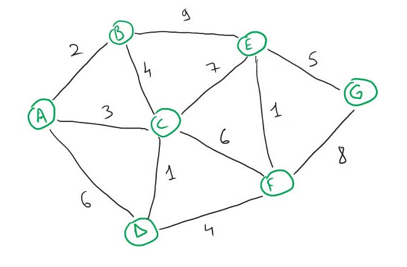

[< А.Пономаренко. Домашние задания к курсам OTUS / Алгоритмы и структуры данных-2022-10 ](../README.md) / Домашнее задание 20. Алгоритм Дейкстры

# Домашнее задание 20. Алгоритм Дейкстры

Реализовать алгоритм Дейкстры

## Цель:

В этом домашнем задании вы научитесь реализовывать алгоритм Дейкстры.

## Описание/Пошаговая инструкция выполнения домашнего задания:

```

Реализовать классику всех времен и народов, алгоритм Дейкстры :)
Граф задан вектором смежности int A[N][Smax]. Это п.5 в структурах данных в лекции. Отличие только в том, что вершины нумеруются от 0 а не от 1, и номера самой вершины первым столбцом в матрице не будет, будут только номера смежных вершин

Задание:
Реализовать алгоритм Дейкстры
Если понадобится использование дерева/кучи обязательно применение собственных структур данных из предыдущих занятий
Можно использовать стандартный массив [] встроенный в язык

Выходные данные:
Результат должен быть представлен в виде массива Edge[] edges где Edge - класс, содержащий пару вершин, которые соединяет это ребро
Edge
{
int v1;
int v2;
}
Для любителей компактного хранения можно упаковать в long два int-а :)
Тогда результат будет long[] edges

Дополнительное задание 1
"Расскажи своей бабушке".
Рассказать идею алгоритма Дейкстры совей бабушке так, чтобы она это поняла. Поделиться своим опытом в слаке. Не забыть приложить ссылку на пост в задании.

Дополнительное задание 2
Реализовать алгоритм Флойда-Уоршалла или Беллама-Форда на выбор
ВАЖНО! При размещении ответа укажите, на каком языке вы выполнили ДЗ. Это поможет нам ускорить его проверку.

Критерии оценки:

Критерии оценки: 1 байт - алгоритм запрограммирован но не работает, 2 байта - алгоритм работает верно, но не оптимально, или есть несоответствия требованиям (например, сделано способом, отличным от указанного) 3 байта - алгоритм работает верно и написан максимально эффективно (нет лишних действий замедляющих работу)
1 байт. Задание сдано в срок.
1 байт. Выполнено дополнительное задание 1
1 байт. Выполнено дополнительное задание 2


```

## Выполнение д/з №20
Реализован алгоритм Дейсктры (см. https://github.com/alexanderpono/ponomarenko-alex-otus/blob/master/algo-2022-10/hw20-Dijkstra/src/Graph.ts)

В качестве входных данных взят граф из вебинара:


Ниже приведены комментарии к фрагментам вывода программы

Исходная матрица смежности в удобном для чтения человеком виде:

```
adjacencyMatrix= 
  AABBCCDDEEFFGG
AA..020306......
BB02..04..09....
CC0304..010706..
DD06..01....04..
EE..0907....0105
FF....060401..08
GG........0508..

```
Исходная матрица смежности - двумерный массив, где строки и столбцы - узлы графа. В ячейках матрицы: 
- точки "..", если соответствующие вершины не образуют ребро графа
- стоимость ребра (двузначное число)

Задача - найти максимально дешевый путь при перемещении по ребрам графа между двумя узлами.
В качестве тестового примера решаем задачу поиска оптимального пути для перемещения из узла G (№6) в узел A (№0)

Исходная матрица смежности в машинном формате - массив 7x7 (в графе 7 вершин).
(см. Graph::initFromAdjacencyString())
Значение "-1" означает, что вершины не образуют ребро графа.

```
adjacencyMatrix= [[-1,2,3,6,-1,-1,-1],[2,-1,4,-1,9,-1,-1],[3,4,-1,1,7,6,-1],[6,-1,1,-1,-1,4,-1],[-1,9,7,-1,-1,1,5],[-1,-1,6,4,1,-1,8],[-1,-1,-1,-1,5,8,-1]]
```

В графе - 12 ребер. В указанном ниже массиве каждое ребро продублировано с указанием направления движения по ребру (от какой вершины до какой). Ребрам присвоена стоимость перемещения в соответствии исходной матрицей смежности
(Graph::calcEdges())

```
edges=
[
   0 { vertex0: 0, vertex1: 1, cost: 2 }
   1 { vertex0: 0, vertex1: 2, cost: 3 }
   2 { vertex0: 0, vertex1: 3, cost: 6 }
   3 { vertex0: 1, vertex1: 0, cost: 2 }
   4 { vertex0: 1, vertex1: 2, cost: 4 }
   5 { vertex0: 1, vertex1: 4, cost: 9 }
   6 { vertex0: 2, vertex1: 0, cost: 3 }
   7 { vertex0: 2, vertex1: 1, cost: 4 }
   8 { vertex0: 2, vertex1: 3, cost: 1 }
   9 { vertex0: 2, vertex1: 4, cost: 7 }
   10 { vertex0: 2, vertex1: 5, cost: 6 }
   11 { vertex0: 3, vertex1: 0, cost: 6 }
   12 { vertex0: 3, vertex1: 2, cost: 1 }
   13 { vertex0: 3, vertex1: 5, cost: 4 }
   14 { vertex0: 4, vertex1: 1, cost: 9 }
   15 { vertex0: 4, vertex1: 2, cost: 7 }
   16 { vertex0: 4, vertex1: 5, cost: 1 }
   17 { vertex0: 4, vertex1: 6, cost: 5 }
   18 { vertex0: 5, vertex1: 2, cost: 6 }
   19 { vertex0: 5, vertex1: 3, cost: 4 }
   20 { vertex0: 5, vertex1: 4, cost: 1 }
   21 { vertex0: 5, vertex1: 6, cost: 8 }
   22 { vertex0: 6, vertex1: 4, cost: 5 }
   23 { vertex0: 6, vertex1: 5, cost: 8 }
]
```

Массив вершин, вычисленный на основе исходной матрицы смежности:
```
vertices after init =
[
   0 { processed: false, accessCost: -1, edgeIndex: -1 }
   1 { processed: false, accessCost: -1, edgeIndex: -1 }
   2 { processed: false, accessCost: -1, edgeIndex: -1 }
   3 { processed: false, accessCost: -1, edgeIndex: -1 }
   4 { processed: false, accessCost: -1, edgeIndex: -1 }
   5 { processed: false, accessCost: -1, edgeIndex: -1 }
   6 { processed: false, accessCost: -1, edgeIndex: -1 }
]

```

В алгоритме происводится обработка вершин в графе, начиная с исходной для перемещения вершины. Ищем самый дешевый путь из вершины 6 в вершину 0:
```
calcVerticesCost() fromVertex= 6 toVertex= 0
```
Начинаем обработку со стартовой вершины 6. Из данной вершины можем переместиться по ребрам 22, 23 в вершины 4 и 5. Вершины 4 и 5 еще не обрабатывались, поэтому их атрибуты содержат значения по умолчанию:
```
edgesOfVertex 6 = [ 22, 23 ]
adjacentVertex= 4 { processed: false, accessCost: -1, edgeIndex: -1 }
adjacentVertex= 5 { processed: false, accessCost: -1, edgeIndex: -1 }
```
После завершения шага 0 - рассчитана стоимость перемещения в вершины 4 и 5 из исходной вершины:
```
vertices after step 0 =
[
   0 { processed: false, accessCost: -1, edgeIndex: -1 }
   1 { processed: false, accessCost: -1, edgeIndex: -1 }
   2 { processed: false, accessCost: -1, edgeIndex: -1 }
   3 { processed: false, accessCost: -1, edgeIndex: -1 }
   4 { processed: false, accessCost: 5, edgeIndex: 22 }
   5 { processed: false, accessCost: 8, edgeIndex: 23 }
   6 { processed: true, accessCost: 0, edgeIndex: -1 }
]
```
Для текущей вершины 6 устанавливаем флаг processed=true.

Определяем, какую из смежных вершин будем рассматривать следующей. Берем вершину, суммарная стоимость перемещения в которую потребует меньше всего затрат:
```
next vertex index =  4
```
Вершина 4 образует 4 ребра. Из вершины 4 можем переместиться в вершины 1,2,5,6.
6 вершина обработана (processed=true), поэтому ее не рассматриваем.
```
edgesOfVertex 4 = [ 14, 15, 16, 17 ]
adjacentVertex= 1 { processed: false, accessCost: -1, edgeIndex: -1 }
adjacentVertex= 2 { processed: false, accessCost: -1, edgeIndex: -1 }
adjacentVertex= 5 { processed: false, accessCost: 8, edgeIndex: 23 }
adjacentVertex= 6 { processed: true, accessCost: 0, edgeIndex: -1 }

```
У вершины 5 стоимость перехода accessCost была = 8. Если перейти в нее из текущей вершины 4 по ребру 16, то суммарная стоимость перехода будет равна 5 + 1, где 5 - стоимость перехода в текущий узел 4, а 1 - стоимость перехода по ребру 16.
5 + 1 = 6 < 8, поэтому переписываем стоимость для узла 5:

```
vertices after step 1 =
[
   0 { processed: false, accessCost: -1, edgeIndex: -1 }
   1 { processed: false, accessCost: 14, edgeIndex: 14 }
   2 { processed: false, accessCost: 12, edgeIndex: 15 }
   3 { processed: false, accessCost: -1, edgeIndex: -1 }
   4 { processed: true, accessCost: 5, edgeIndex: 22 }
   5 { processed: false, accessCost: 6, edgeIndex: 16 }
   6 { processed: true, accessCost: 0, edgeIndex: -1 }
]
```
Среди необработанных смежных вершин 1, 2, 5 наименьшая стоимость accessCost=6 у 5 узла:
```
next vertex index =  5
```
На шаге 2 обрабатываем узел 5:
```
edgesOfVertex 5 = [ 18, 19, 20, 21 ]
adjacentVertex= 2 { processed: false, accessCost: 12, edgeIndex: 15 }
adjacentVertex= 3 { processed: false, accessCost: -1, edgeIndex: -1 }
adjacentVertex= 4 { processed: true, accessCost: 5, edgeIndex: 22 }
adjacentVertex= 6 { processed: true, accessCost: 0, edgeIndex: -1 }
vertices after step 2 =
[
   0 { processed: false, accessCost: -1, edgeIndex: -1 }
   1 { processed: false, accessCost: 14, edgeIndex: 14 }
   2 { processed: false, accessCost: 12, edgeIndex: 15 }
   3 { processed: false, accessCost: 10, edgeIndex: 19 }
   4 { processed: true, accessCost: 5, edgeIndex: 22 }
   5 { processed: true, accessCost: 6, edgeIndex: 16 }
   6 { processed: true, accessCost: 0, edgeIndex: -1 }
]
next vertex index =  3
```
На шаге 4 обрабатываем узел 3:
```
edgesOfVertex 3 = [ 11, 12, 13 ]
adjacentVertex= 0 { processed: false, accessCost: -1, edgeIndex: -1 }
adjacentVertex= 2 { processed: false, accessCost: 12, edgeIndex: 15 }
adjacentVertex= 5 { processed: true, accessCost: 6, edgeIndex: 16 }
vertices after step 3 =
[
   0 { processed: false, accessCost: 16, edgeIndex: 11 }
   1 { processed: false, accessCost: 14, edgeIndex: 14 }
   2 { processed: false, accessCost: 11, edgeIndex: 12 }
   3 { processed: true, accessCost: 10, edgeIndex: 19 }
   4 { processed: true, accessCost: 5, edgeIndex: 22 }
   5 { processed: true, accessCost: 6, edgeIndex: 16 }
   6 { processed: true, accessCost: 0, edgeIndex: -1 }
]
next vertex index =  2
```
Шаг 5, узел 2:
```
edgesOfVertex 2 = [ 6, 7, 8, 9, 10 ]
adjacentVertex= 0 { processed: false, accessCost: 16, edgeIndex: 11 }
adjacentVertex= 1 { processed: false, accessCost: 14, edgeIndex: 14 }
adjacentVertex= 3 { processed: true, accessCost: 10, edgeIndex: 19 }
adjacentVertex= 4 { processed: true, accessCost: 5, edgeIndex: 22 }
adjacentVertex= 5 { processed: true, accessCost: 6, edgeIndex: 16 }
vertices after step 4 =
[
   0 { processed: false, accessCost: 14, edgeIndex: 6 }
   1 { processed: false, accessCost: 14, edgeIndex: 14 }
   2 { processed: true, accessCost: 11, edgeIndex: 12 }
   3 { processed: true, accessCost: 10, edgeIndex: 19 }
   4 { processed: true, accessCost: 5, edgeIndex: 22 }
   5 { processed: true, accessCost: 6, edgeIndex: 16 }
   6 { processed: true, accessCost: 0, edgeIndex: -1 }
]
```
Из текущего узла 2 можем перейти в необработанные узлы 0 и 1. У этих узлов стоимость одинаковая = 14. Выбираем 0:

```
next vertex index =  0
```

```
edgesOfVertex 0 = [ 0, 1, 2 ]
adjacentVertex= 1 { processed: false, accessCost: 14, edgeIndex: 14 }
adjacentVertex= 2 { processed: true, accessCost: 11, edgeIndex: 12 }
adjacentVertex= 3 { processed: true, accessCost: 10, edgeIndex: 19 }
vertices after step 5 =
[
   0 { processed: true, accessCost: 14, edgeIndex: 6 }
   1 { processed: false, accessCost: 14, edgeIndex: 14 }
   2 { processed: true, accessCost: 11, edgeIndex: 12 }
   3 { processed: true, accessCost: 10, edgeIndex: 19 }
   4 { processed: true, accessCost: 5, edgeIndex: 22 }
   5 { processed: true, accessCost: 6, edgeIndex: 16 }
   6 { processed: true, accessCost: 0, edgeIndex: -1 }
]
next vertex index =  1

```
Остался один необработанный узел 1:
```

edgesOfVertex 1 = [ 3, 4, 5 ]
adjacentVertex= 0 { processed: true, accessCost: 14, edgeIndex: 6 }
adjacentVertex= 2 { processed: true, accessCost: 11, edgeIndex: 12 }
adjacentVertex= 4 { processed: true, accessCost: 5, edgeIndex: 22 }
```
После шага 6 для каждого узла прописана суммарная стоимость перехода из исходного узла 6, а также номер ребра, по которому происходит переход.
```
vertices after step 6 =
[
   0 { processed: true, accessCost: 14, edgeIndex: 6 }
   1 { processed: true, accessCost: 14, edgeIndex: 14 }
   2 { processed: true, accessCost: 11, edgeIndex: 12 }
   3 { processed: true, accessCost: 10, edgeIndex: 19 }
   4 { processed: true, accessCost: 5, edgeIndex: 22 }
   5 { processed: true, accessCost: 6, edgeIndex: 16 }
   6 { processed: true, accessCost: 0, edgeIndex: -1 }
]
```
Больше не осталось узлов для обработки.
```
next vertex index =  -1

```
Сформированный список ребер для максимально "дешевого" перехода из узла 6 в узел 0:
```
printEdgesInCheapestPath() 
from Vertex 6 to 0
edge 22 { vertex0: 6, vertex1: 4, cost: 5 }
edge 16 { vertex0: 4, vertex1: 5, cost: 1 }
edge 19 { vertex0: 5, vertex1: 3, cost: 4 }
edge 12 { vertex0: 3, vertex1: 2, cost: 1 }
edge 6 { vertex0: 2, vertex1: 0, cost: 3 }
target Vertex 0 { processed: true, accessCost: 14, edgeIndex: 6 }

```
Вычисленная последовательность узлов при переходе из узла 6 в узел 0:
```
FROM: 6(cost:0, goCost(0))
->0(edgeCost:3, moveCost:3)
->2(edgeCost:1, moveCost:4)
->3(edgeCost:4, moveCost:8)
->5(edgeCost:1, moveCost:9)
->4(edgeCost:5, moveCost:14)
TO: 0(accessCost: 14)

```

### Затраты времени:
5 часов

### Язык программы: Javascript/Typescript

### Запуск программы
Предусловие: необходима установленная версия node.js 12.22.12 или 14.x
- https://nodejs.org/download/release/v12.22.12/
- https://nodejs.org/download/release/v14.21.2/

1. Клонировать проект: 
```
git clone https://github.com/alexanderpono/ponomarenko-alex-otus.git
```

2. Зайти в папку д/з №20: 
```
cd ./ponomarenko-alex-otus/algo-2022-10/hw20-Dijkstra
```

3. установить зависимости:  
```
npm i
```

4. Запустить программу (см. https://github.com/alexanderpono/ponomarenko-alex-otus/blob/master/algo-2022-10/hw20-Dijkstra/src/app.ts)
```
npm start
```
