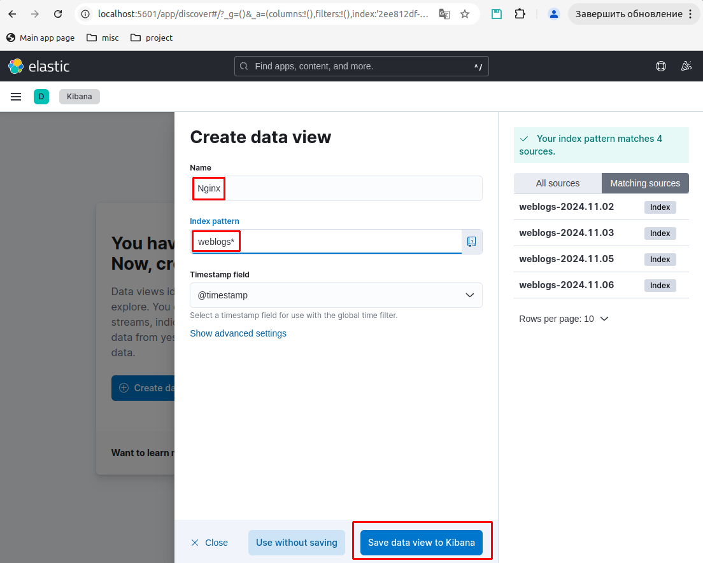

# План аварийного восстановления инфраструктуры web-приложения

## 1. Предусловия
1.1. Установлен docker

1.2. Есть сетевой доступ к Docker hub (для возможности скачивания docker-образов)

## 2. Настройка параметров конфигурации

2.1. Создать файл ./params/db_backup.sql с дампом базы данных проекта (см. пример [./params/db_backup.sql.example](./params/db_backup.sql.example))

2.2. Создать файл ./params/DB_USER_API_PASS для задания пароля пользователя "API-запись в базу" web-приложения, значение должно быть заключено в прямые одинарные кавычки (см. пример [./params/DB_USER_API_PASS.example](./params/DB_USER_API_PASS.example))

2.3. Создать файл ./params/DB_USER_LOCAL_READ_PASS для задания пароля пользователя "Локальное чтение из базы" web-приложения, значение должно быть заключено в прямые одинарные кавычки (см. пример [./params/DB_USER_LOCAL_READ_PASS.example](./params/DB_USER_LOCAL_READ_PASS.example))

2.4. Создать файл ./params/DB_USER_READ_PASS для задания пароля пользователя "Удаленное чтение из базы" web-приложения, значение должно быть заключено в прямые одинарные кавычки (см. пример [./params/DB_USER_READ_PASS.example](./params/DB_USER_READ_PASS.example))

2.5. Создать файл ./params/DB_USER_REPL_PASS для задания пароля пользователя "Репликация" web-приложения, значение должно быть заключено в прямые одинарные кавычки (см. пример [./params/DB_USER_REPL_PASS.example](./params/DB_USER_REPL_PASS.example))

2.6. Создать файл ./params/mysql-root для задания пароля пользователя "root" MySQL-сервера, значение должно быть указано БЕЗ ОБРАМЛЯЮЩИХ КАВЫЧЕК (см. пример [./params/mysql-root.example](./params/mysql-root.example))

2.7. Создать файл .env. За основу можно взять .env.example
В файле .env задать значения:
ELASTIC_PASSWORD
KIBANA_PASSWORD
PROJECT_DB_SOURCE_IP (IP-адрес Source-узла БД приложения)
PROJECT_DB_REPLICA_IP IP-адрес Replica-узла БД приложения

2.8. Назначить сетевому интерфейсу хоста статический адрес PROJECT_DB_SOURCE_IP
2.9. Назначить сетевому интерфейсу хоста статический адрес PROJECT_DB_REPLICA_IP

## 3. Сборка файлов конфигурации
3.1. Запустить скрипт для сборки файлов конфигурации web-приложения из шаблонов и значений, заданных в папке ./params.
```
bash ./buildConfigs.sh
```

В результате выполнения скрипта должны создаться файлы:
* ./project-db-source/mysql-init-db/init.sql
* ./project-db-source/mysql-secrets/mysql-root
* ./project-db-replica/mysql-secrets/mysql-root
* ./docker-compose.yml
* ./html/mysql-requisites.php


## 4. Настройка папок проекта
Linux - Запустить скрипт настройки папок проекта (понадобятся поолномочия sudo)

```
bash ./fixFolders.sh
```

## 5. Запуск web-приложения
5.1. Запустить web-приложение

```
sudo docker-compose up
```

## 6. Настройка dashboard в Grafana
### 6.1. Проверка работоспособности Prometheus

В браузере открыть http://localhost:9090/

Должен открыться веб-интерфейс:

Подтверждение, что Prometheus работает

### 6.2. Проверка работоспособности Node-explorer

В браузере открыть http://localhost:9100/

Должен открыться веб-интерфейс:

Подтверждение, что Node-explorer работает

### 6.3. Проверка, что Node-explorer возвращает данные

В браузере открыть http://localhost:9100/metrics

Должно открыться что-то вроде этого:

Подтверждение, что Node-explorer возвращает данные

### 6.4. Проверка работоспособности Grafana

В браузере открыть http://localhost:9110/

Должен открыться веб-интерфейс:

Подтверждение, что Grafana работает

Ввести реквизиты: 
```
login = admin 
password = admin
```
и задать собственный пароль


### 6.5. Настройка дашборда Grafana

На главном экране Grafana нажимаем на кнопку меню "Бутерброд":


В открывшемся меню выбираем Источники данных "Connections":


Вводим "Prome" в поле поиска "Search all":


И видим, что появился баннер Prometheus. Нажимаем на этот баннер:


На открывшейся странице нажимаем "Add new data source":


Вводим Имя="Prometheus", "Prometheus server url"="http://prometheus:9090"


Проматываем страницу вниз и нажимаем "Save & test":


В главном меню "Бутерброд" выбираем "Dashboards":


На открывшейся странице выбираем "New", "Import":


На открывшейся странице можно перейти к каталогу дашбордов. Вводим ID дашборда = 1860, нажимаем "Load":


Заполняем поле "Name", выбираем в списке источников - ранее добавленный источник "Prometheus" и нажимаем "Import":


Должна открыться страница вида:


### 7. Настройка дашборда Kibana
### 7.1. Проверка работоспособности Elastic search

В браузере открыть http://localhost:9200/

Должен открыться веб-интерфейс:

Подтверждение, что Elastic search работает

### 7.2. Настройка дашборда Kibana
В браузере открыть http://localhost:5601/

На главном экране Kibana нажимаем на кнопку меню "Add integrations":


На странице Integrations нажимаем на кнопку меню "Бутерброд":


В открывшемся меню выбираем пункт "Discover"


На окрывшейся странице нажимаем "Create data view"


В открывшемся окне вводим Name="Nginx", Index pattern="weblogs", нажимаем кнопку "Save data vew to Kibana"


Должна открыться страница вида:


На окрывшеся странице выбираем кнопку "Бутерброд" в левом верхнем углу, в открывшемся меню - "Dashboard"


Нажимаем на кнопку "Create visualization"


На готкрывшейся странице нажимаем список с типами диаграмм, прокручиваем список вниз и выбираем "Donut"


После чего в строке поиска полей вводим "http", наводим на строку "http.response.status.code" и кликаем на "+" на этой строчке


Появляется бублик. Скорректируем бублик - очищаем поле ввода названий полей, наводим на кнопку "Records" и нажимаем на появившуюся кнопку "+"


Бублик видоизменяется. Нажимаем на кнопку "Save and return":


На открывшейся странице Dashboard выюираем "Create vizualization"


Вводим в поиске полей значение "source", наводим курсор мыши на строчку "source.address.keyword" и нажимаем на появившийся "+". Далее нажимаем на "Save and return"


Должен отобразиться походий экран:


# Использованные источники
* https://otus.ru/lessons/linux-basic/
* https://dockerhosting.ru/blog/zapusk-prometheus-v-docker/
* https://elastic.co
* https://discuss.elastic.co
